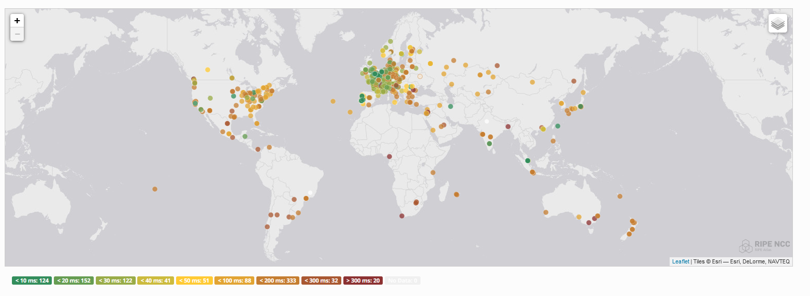
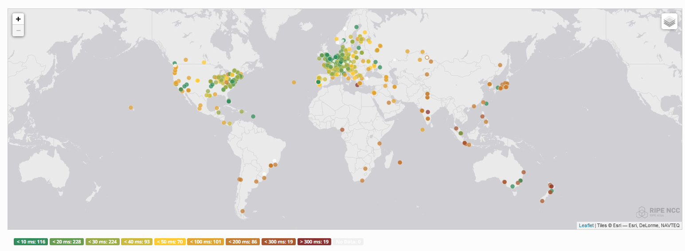
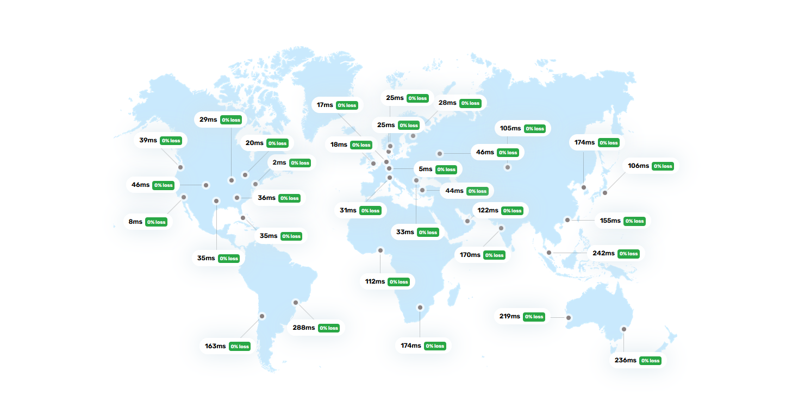

Cloudflare is expanding at a rapid pace, with more and more offerings built upon their Anycast Network.

You can acquire a domain via Cloudflare's registrar, hook it up to their CDN and DNS Services, host your content on Cloudflare Pages, and have everything nicely contained within the Cloudflare ecosystem. All backed by their [Anycast infrastructure](https://www.cloudflare.com/learning/cdn/glossary/anycast-network/), giving good performance no matter where your visitors are.

 Not to mention, all of it is free besides the registrar, and even then the Cloudflare Registrar is selling the domains with zero markup.

This is a very powerful offering, and I was interested in how I could replicate something like this on a smaller scale, while still having good worldwide latency thanks to Anycast.

I started with trying to make my own Anycast Network.

There are various services that you could use to deliver services at low latency to users of different geographic locations. [Anycast as a service](https://rage4.com/#anycast) does exist, as well as more traditional offerings like [Load Balancers with geo steering](https://developers.cloudflare.com/load-balancing/understand-basics/traffic-steering/steering-policies/geo-steering/), GeoDNS, or going with a split option like [LinkedIn](https://engineering.linkedin.com/network-performance/tcp-over-ip-anycast-pipe-dream-or-reality) did, with Anycast for specific continents, backed by GeoDNS. For the sake of learning though, I wanted to go the same route Cloudflare did and only rely on Anycast routing. 

### Picking a provider that offers BGP Sessions / IP Transit


Only some hosts will provide IP Transit (announce your IPs through their transit providers, so the rest of the world can reach you) and offer BGP Sessions. Luckily, there is a super nice community list at https://bgp.services/ that lists Providers, route type, fees, minimum service required, and more.

I ended up going with [Vultr](https://www.vultr.com/) (Operated by Constant), and [BuyVM](https://buyvm.net/) (Operated by Frantech). BuyVM offers IPv4 Anycast for free if you have a VPS purchased in 3 of their locations (NY, Lux, and LV), but server stock is rather limited. Vultr has a ton of locations, with varying upstreams and quality.

[Xenyth](https://xenyth.net/) (Canada), [IFog](https://ifog.ch/en) (US, EU, APAC), [Terrahost](https://terrahost.com) (EU & US), and [Misaka](https://www.misaka.io/) (All Regions), are some others I personally use (although not all for the Anycast) and would recommend. If you are wondering who to pick (or start with), I would recommend Vultr. They've got a ton of locations, solid pricing, no bgp fee, stable & fully automated BGP Sessions. 

### Acquiring an ASN & IP Addresses

Acquiring an Autonomous System Number (ASN) & IP Space can be rather expensive. I looked around for the cheapest option, and I stumbled on RIPE LIRs (Local Internet Registries), that can sponsor your ASN application to RIPE. They also can provide you either Provider-aggregatable address space (PA Address Space that belongs to them, and you will lose if you switch LIRs), or Provider-Independent Address Space (PI Address Space that belongs to you, but costs a lot more). You need IP space for the ASN application.

Another advantage of RIPE is that they allow individuals to register, and you don't even have to be in the RIPE region yourself if you have proof of presence (more on that later).

There are several RIPE LIRs, but I picked [Inferno Communications](https://infernocomms.com/lir-services) based on them being recommended in one of the communities I am in (Cloudflare Developers). Getting an ASN through them costs around 54 USD (£45 GBP) one-off and ~$48 USD (£40 GBP) per year for IPv6 /44, which can be split into 16 /48's, the max subnet size that can be announced without being filtered. If you're looking for other providers, I've heard good things about [Cloudie](https://my.cloudie.sh/index.php/store/lir-services) as well as their Discord Community and support.

I created an account in RIPE's Database and created several RIPE objects including an Organization, Contact, and Maintainer.

The ASN Application is really simple, asking you for IDs of the aforementioned RIPE Resources (ORG, Contact, Maintainer), as well as IP space you are going to use (may be purchased from the same LIR as you are applying with), and two other ASNs you intend to peer with. I just put down BuyVM (Frantech) & Vultr (Constant).

I had to prove my identity via a third-party service called Yoti, which is required by all RIPE for all individual registrations. Since I am in the US, I also needed an invoice for a resource (i.e VPS, etc) in Europe/RIPE's Jurisdiction to prove my presence in the RIPE Region.

It took around 2 business days to get my Resources allocated to me, AS205398 and 2a0f:85c1:260::/44. I put in another request with the LIR and got maintainer access on my IPv6 address block, and created a route6 entry for Internet Routing Registry (IRR) Filtering. If you use Vultr, they create an IRR entry for you in RADB, but they will remove it if you ever leave them, and some hosts like Virtua Cloud will only allow you to announce prefixes based on IRR entries (Filtering on IRR) but exclude RADB.

I set up RPKI as well, as BuyVM/Frantech filter prefixes you are allowed to announce based on valid Route Origin Authorizations (ROAs) for your ASN. Some LIRs have web portals for you to add RPKI entries, but in my case, it just took a quick email with the settings I wanted (Prefix, ASN, max length).
 
### Setting up the Anycast Network

I used BIRD 1 to set up the BGP Sessions, [Vultr has a good guide on it](https://www.vultr.com/docs/configuring-bgp-on-vultr/), and there are [a few Github Gists](https://gist.github.com/aveao/24524caebc2709dd86ba6ea14728def7) and other resources of example configurations. There is a TON of Docs on BIRD, both on [Bird](https://bird.network.cz/doc/bird-3.html) and [Bird 2](https://bird.network.cz/?get_doc&f=bird.html&v=20).

I split my /44 into 16 /48's, the first one (2a0f:85c1:260::/48) for Anycast, and one /48 per each location, for potential GeoDNS in the future. I did also experiment with having one anycast for an entire region (NA, EU, Asia-Pacific), but it didn't provide any real benefits.

I used RIPE Atlas to measure network performance, with a traceroute from 1,000 devices.



The first setup wasn't too great. I looked into BGP Community guides for my hosts BuyVM (In dashboard) & [Vultr](https://www.vultr.com/docs/as20473-bgp-customer-guide/) and disabled everything but GTT and Cogent. I looked up BGP communities for [GTT](https://www.gtt.net/us-en/services/internet/ip-transit/bgp-communities) and [Cogent](https://www.cogentco.com/files/docs/customer_service/guide/global_cogent_customer_user_guide.pdf) for region settings, and used their BGP communities to try to steer traffic for specific regions.

For example, for Vultr in AMS
```bird
 export filter {
 if net ~ 2a0f:85c1:260::/48 then {
    bgp_community.add((64600, 6939)); # 6939 Disable Hurricane Electric
    bgp_community.add((64600, 2914)); # 2914 Disable NTT
    bgp_community.add((64600, 1239)); # 1239 Disable Sprint
    bgp_community.add((64600, 1299)); # 1299 Disable Telia
    bgp_community.add((64600, 3356)); # 3356 Disable Level3
    # Cogent BGP Communities
    bgp_community.add((174,972)); # Set localpref to 10 in NA
    bgp_community.add((174,962)); # Set localpref to 10 in Asia Pacific
    # GTT BGP Communities
    bgp_community.add((3257,2592)); # Prepend 2x in Asia - GTT
    bgp_community.add((3257,2992)); # Prepend 2x in America - GTT
 }
 if net ~ 2a0f:85c1:260::/44 then accept;
 reject;
 };
```
After that, latency looks a bit better:






The Anycast location you hit is:




There is a ton of tools that can be used to try to optimize Anycast networks. RIPE Atlas is one of the best tools, measuring performance not just from a Datacenter to you, but from actual consumer ISPs, thanks to people who have set up probes of their own in all sorts of networks.

Here are a few I found useful:

https://atlas.ripe.net (You need credits, earned by running your probes, you can set up a software probe pretty easily)

https://bgp.tools - Note that upstreams are just a guess

https://tools.bunny.net - Only a few locations support IPv6

https://lg.ring.nlnog.net/ - Best used for BGP map


Examples:

https://atlas.ripe.net/measurements/41692485/#map

https://bgp.tools/prefix/2a0f:85c1:260::/48#connectivity

https://tools.bunny.net/latency-test?query=tobrien.dev

https://lg.ring.nlnog.net/prefix_bgpmap/lg01/ipv6?q=2a0f:85c1:260::1


### Closing Notes

There's still lots for me to learn about BGP, Anycast networks, and optimizing these routes, but it's really cool to see how Anycast works and how to optimize it.

If you're curious the tech stack of this website (tobrien.dev), see [Building a Cloudflare Pages Clone ]( "How I build a Cloudflare Pages Clone, including DNS").
