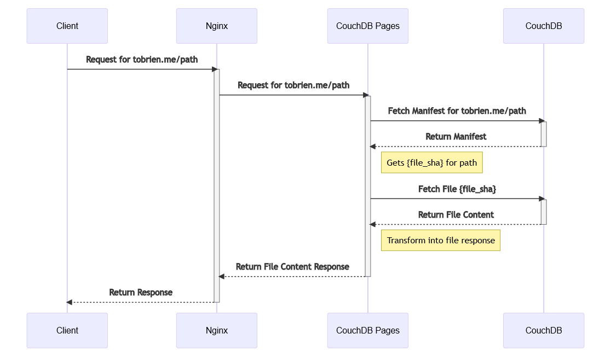
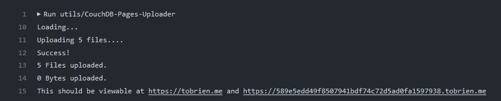
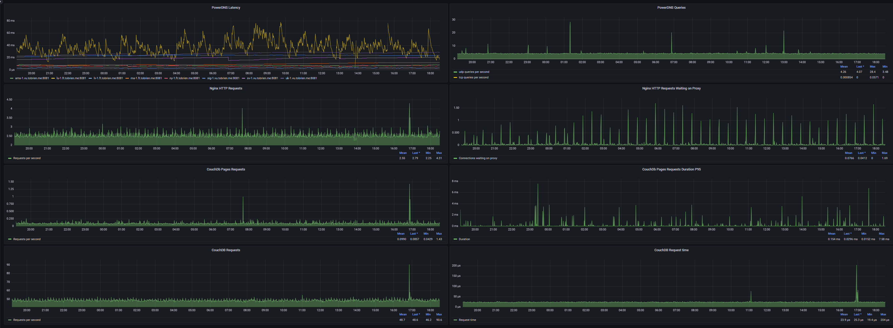

Github Pages, or Cloudflare Pages, are both great offerings for static sites that offer good integration with CI/CD and good performance. Cloudflare Pages specifically is built on top of Cloudflare's Workers KV Store, allowing your website, if popular enough, to exist in every one of Cloudflare's 350+ Datacenters, all for free.

To replicate this functionality, I needed some technology or database that was made for cross datacenter or cross region replication, could store files and was multi-master. I ended up going with CouchDB, a NoSQL Eventually Consistent Database, with its powerful HTTP API, and simple HTTP-based replication that could deal with latency or even outages of replication targets gracefully. CouchDB supported Attachments as a way to store files, but it was only made for documents of 8 MB or so in size. Cloudflare Pages only supports files of up to 25 MB, so I decided this was an acceptable trade-off.

Looking back on this now, I could have gone with any database for metadata and SeaweedFS for the file layer, or any other generic file replication layer. Having it all in CouchDB did make things easier though.

### Wireguard Mesh Private VLAN

I needed some way to secure replication. I could have used SSL/TLS certs configured with CouchDB directly, and a firewall like UFW to restrict CouchDB connections for other machines, but it seemed suboptimal and messy. I decided to go with a mesh network on Wireguard, where CouchDB communication (and other internal requests) would flow over Wireguard securely. There are a lot of other options too, like [ZeroTier](https://www.zerotier.com/), [TailScale](https://tailscale.com/), [Netbird](https://netbird.io/), and more, but I didn't want a single point of failure, I wanted to host everything myself, and those seemed overcomplicated. Jawher Moussa has [a guide](https://jawher.me/wireguard-ansible-systemd-ubuntu/) on using ansible to create a WireGuard mesh, which [I forked and modified to use wg-quick](https://github.com/Tyler-OBrien/wireguard-mesh-network-ansible).  

Each location gets one IPv4 /16 out of 10.0.0.0/8 Private IP Range, letting me have 256 locations with ~65534 servers per location. It was also trivial to set up another WireGuard tunnel forwarding packets onto the wireguard mesh network, so I could also easily access all internal resources securely.


I kept track of each locations information for ease of setting up Ansible and other tools

For example, New York: 
```
FQDN: <Internal domain name>
Location: New York
IP: <Public IP assigned by BuyVM>
Private IP: 10.0.0.1 
Owned IPV6 Block: 2a0f:85c1:261::/48
```

### CouchDB Replication

I hacked together another [Ansible playbook to install CouchDB and configure replication.](https://github.com/Tyler-OBrien/automatic_couchdb_replication_ansible) 

It also allows me to create and replicate any database after setup is done, making it easy to add more databases. Ansible makes deployment really easy, instead of repeating commands and configs on lots of different machines.

Lastly, I decided to use nginx as the public web server, and just act as a reverse proxy to get the actual assets.

With the infrastructure in place, I focused on the software itself.

To replicate the core functionality of Cloudflare Pages, I needed a few separate parts.

### Core Web Server ("CouchDB Pages Server")

The core, or main web server, needs to serve the actual files, allowing previews, and also handling new deployments.

To solve that problem, I create and use manifests for each hostname. Manifests are stored as CouchDB Documents, with their IDs being the hostname, and containing a dictionary to link files (images/example.png) to their actual file ID, which was just a sha256 hash of the file contents. Each file was stored in a separate CouchDB Database, with its ID being the sha256 hash of its file contents, and itself being a CouchDB Attachment. CouchDB offered a few other helpful features by it storing and returning content type and eTags, which we could use in the response.


* The domain is now tobrien.dev


### CLI Tool

Next, there needs to be a tool that could be used in a CI/CD Environment like Github Actions to handle uploading for us. I made a simple .NET CLI tool that could upload all of the files in a directory, and create a manifest. A simple API Key is used for authentication, stored in CouchDB as well.





One other related problem that had to be solved was handling the SSL/TLS certs themselves. Let's Encrypt (LE) has a rate limit of 5 certs per 24 hours per domain set. To work around this, I just made another simple .NET CLI tool, ran by cron, that would use XCHACHA20-Poly1035 to encrypt the private key and public certs from a single main machine, and other machines would download and decrypt. The encrypted files are stored in CouchDB, and the symmetric encryption key is stored in the file system. This brings us back down to the security level of trusting the file system, which we would be at if we could use Certbot/LE directly.


### PowerDNS

Another aspect of Cloudflare's setup is DNS. For the fun of the challenge, I made a Remote backend for PowerDNS Authoritative DNS Server, using CouchDB and ASP.NET Core. Using Certbot's custom auth and cleanup hooks and a simple bash script, Certbot can also work with this custom DNS Setup. 

Since I am self-hosting my own Authoritative DNS, I had to add glue records via my Registrar's dashboard so they could be resolved, but other than that there were no issues with this setup. You can even name your nameservers whatever you want.

### Setup

I used small 1GB / 1 vCPU Virtual Private Servers for each of the 7 nodes in this cluster. They all run CouchDB, PowerDNS, Nginx, and the CouchDB Pages and CouchDB DNS apps. This setup uses ~600 MB of the available memory, which isn't bad. I used [loader.io by SendGrid](https://loader.io/) to load test one of the nodes, and it could sustain around ~5000 requests/second without tripping loader.io's timeout protection (6% timed out).

### Monitoring

I was surprised to see how many of these applications support Prometheus metrics out of the box. CouchDB has an endpoint for Prometheus at [/_node/_local/_prometheus](https://docs.couchdb.org/en/3.2.0/api/server/common.html?highlight=Prometheus#get--_node-node-name-_prometheus), PowerDNS has its own [Prometheus endpoint](https://doc.powerdns.com/recursor/http-api/prometheus.html) via its built in web server, [Prometheus-net](https://github.com/prometheus-net/prometheus-net) exists with built-in support for ASP.NET, for nginx there is [nginx-prometheus-exporter](https://github.com/nginxinc/nginx-prometheus-exporter), and lastly there is [Node Exporter](https://github.com/prometheus/node_exporter) for system metrics. I set up my Prometheus and Grafana stack on my main instance in New York from BuyVM, which I added an extra gigabyte of RAM for, and set all Prometheus data to be put on a 250GB Storage Slab. 

It's easy to combine all of these metrics and get a nice overview dashboard, as well as more focused dashboards for each specific service.

I also used Datadog for remote monitoring of the website and the Authoritative DNS and Sentry for error reporting.


[Bigger picture](grafana.png)


### Finishing Notes

The Main server for handling new uploads/deployments and requests is open source at https://github.com/Tyler-OBrien/CouchDB-Pages

The PowerDNS Remote Backend for CouchDB is at https://github.com/Tyler-OBrien/PowerDNS-Authoritative-CouchDB-Backend

This website with automatic deployments via CouchDB Pages can be found at https://github.com/Tyler-OBrien/Personal-Website-CouchDB-Pages

Building this was fun, CouchDB is graceful with its setup and responses, and is fun to build around. Continuous Delivery/Integration can be set up [quite easily](https://github.com/Tyler-OBrien/Personal-Website-CouchDB-Pages/blob/master/.github/workflows/couchdb_deploy.yml) with the CLI tool.  This setup has a surprisingly small footprint. The only thing I worry about is the loss of one location causing regional issues that would be hard to verify, Datadog helps a bit with its many locations, but not entirely.

Update: tobrien.dev is now the home of this, instead of tobrien.me.