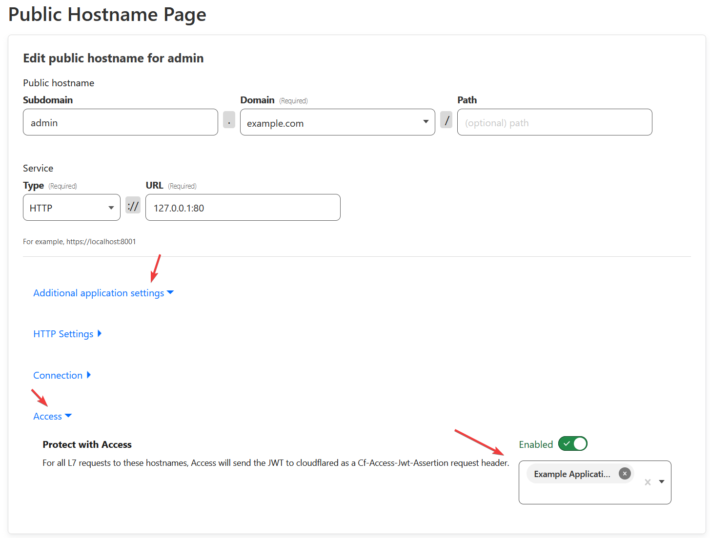

Cloudflare is used by some [20% of the web](https://w3techs.com/technologies/details/cn-cloudflare), primarily known for its Pull Content Delivery Network Service. Cloudflare offers extensive security tools but if you do not configure your origin web server (the one behind Cloudflare!) correctly, this all becomes useless.

[Cloudflare](https://developers.cloudflare.com/fundamentals/get-started/task-guides/origin-health/pro/) and many others have guides on securing your origin, but I found most of them gloss over Authenticated Origin Pulls or discussing entire setups.

Cloudflare and other CDNs can seem magical, but it's important to remember fundamentally it's just an intelligent reverse proxy, turning around and requesting from your real origin when needed. It does nothing to the security of your origin itself, and without further configuration, it is easy to find the real origin and circumvent Cloudflare entirely.


### Prerequisites

You should have proxy enabled, your origin web server has a valid non-expired trusted certificate, and your SSL/TLS Mode is Full (Strict). Any other mode is **insecure**. 

If you need a valid certificate for your server, consider [Cloudflare Origin CA Certs](https://developers.cloudflare.com/ssl/origin-configuration/origin-ca/), trusted by the Cloudflare Proxy.

Make sure your origin web server only responds to requests with the correct host header/SNI as well, achieved in nginx via the [server_name directive](https://nginx.org/en/docs/http/server_names.html). This can help protect against some scraping and attacks.

### Only allowing traffic from Cloudflare IPs

Once your web server is set up properly, scanners like Shodan and Censys can still pick up your real origin behind Cloudflare. Scanning the entire IPv4 space is [trivial](https://www.securitynewspaper.com/2015/10/15/how-to-scan-whole-internet-3-7-billion-ip-addresses-in-few-minutes/), and one of the ways these scanners find your origin. They discover your web server and try to connect to it, your website then will either contain your website's domain in the certificate, the same document title, or some other content match. 

Once your origin's IP is exposed, attackers can target it rather than going through Cloudflare, and you lose Cloudflare's protections. Even if you add in a proper firewall after, attackers can resort to brute force attacks and overwhelm your server in bandwidth alone, your only option being to rotate the origin's IP.

Only allowing Cloudflare IPs depends on your web server and setup. Cloudflare has a generic guide [here](https://developers.cloudflare.com/fundamentals/get-started/setup/allow-cloudflare-ip-addresses/#configure-origin-server). If your host like OVH or Hetzner has an external firewall you can configure it from their panel, it is good to configure that as well as you can block the traffic before it even reaches your server, giving you the filtering capacity of their firewall instead of just your host's. 

Otherwise, I usually stick to a simple automated [ufw setup](https://github.com/Paul-Reed/cloudflare-ufw). Cloudflare IPs may change in the future, so it's worth automating the process if you can.

You can restrict the port to just 443, in combination with HTTPS Redirects configured within Cloudflare.

If you are using the UFW shell script above, modify it to be so:
```shell
for cfip in `curl -sw '\n' https://www.cloudflare.com/ips-v{4,6}`; do ufw allow from $cfip proto tcp to any port 443 comment 'Cloudflare IP'; done
```
Otherwise, potentially Cloudflare Spectrum Customers can point at any port on your origin which otherwise wouldn't be exposed. For example, Pro or above can use SSH Spectrum and bypass UFW SSH IP Whitelisting.
Why not allow Cloudflare's entire ASN (13335)? 
Cloudflare has a lot of other products these days, like Cloudflare WARP, a Wireguard-based VPN, which uses the same ASN.

### Authenticated Origin Pulls

Cloudflare offers a feature called [Authenticated Origin Pulls](https://developers.cloudflare.com/ssl/origin-configuration/authenticated-origin-pull/explanation/) (AOP), in which Cloudflare presents a TLS Client Certificate when trying to connect to your origin web server. Your origin web server then can be configured to check for that certificate, so you have a guarantee it came from Cloudflare. 

Authenticated Origin Pulls can even be implemented in some environments where you cannot outright block all non-Cloudflare IPs, but you can configure your web server/application to validate client certificates.

You *could* set up and configure Authenticated Origin Pulls with the default certificate, configure it on your web server to be validated, and be protected from most attacks. However, Enterprise users can use Host Header Overwrites to rewrite the host header (and TLS Server Name Identifier), enable AOP, and bypass all of your protections, as long as they know your origin's real IP. Even without knowing your origin's real IP, there is potential exploits with URL Smuggling and bugs within Cloudflare that AOP can help protect against.

Luckily, Authenticated Origin Pulls also lets you create and upload your own certificate for a specific hostname that will be served.

You can use OpenSSL to generate a usable certificate. Per hostname Authenticated Origin Pulls are only available through the API for now, so you'll have to use it as well, and lastly enable the certificate for a specific hostname:

These use an expiration of 15 years to match the default origin cert expiration but feel free to customize the -days parameter.
```shell
# Generate root ca & certificate. Follow the prompts
openssl req -nodes -x509 -days 5475 -newkey rsa:2048 -keyout ca_private_key.pem -out ca_cert.pem

# Generate the certificate request. You can add more alt names as well, separated by commas. If you do though, you'll need to enable the certificate for each hostname or use zone AOP cert.
openssl req -new -nodes -newkey rsa:2048 -keyout my_private_key.pem -out my_cert_req.pem  -subj "/CN=example.com"   -addext "subjectAltName=DNS:example.com"
# Generate the cert off the request
openssl x509 -req -in my_cert_req.pem -days 5475 -CA ca_cert.pem -CAkey ca_private_key.pem -CAcreateserial -out my_signed_cert.pem

MYCERT="$(cat my_signed_cert.pem|perl -pe 's/\r?\n/\\n/'|sed -e 's/..$//')"
MYKEY="$(cat my_private_key.pem|perl -pe 's/\r?\n/\\n/'|sed -e's/..$//')"
REQUEST_BODY="{ \"certificate\": \"$MYCERT\", \"private_key\": \"$MYKEY\" }" 
curl -sX POST https://api.cloudflare.com/client/v4/zones/$zoneid/origin_tls_client_auth/hostnames/certificates -H "X-Auth-Email: $cf_email" -H "X-Auth-Key: $cf_key" -H "Content-Type: application/json" -d "$REQUEST_BODY"

# Enable the Cert. Copy the Cert ID from above

curl -sX PUT https://api.cloudflare.com/client/v4/zones/$zoneid/origin_tls_client_auth/hostnames -H "X-Auth-Email: $cf_email" -H "X-Auth-Key: $cf_key" -H "Content-Type: application/json" -d  $(echo "{\"config\":[{\"hostname\":\"$cf_hostname\",\"cert_id\":\"$clientcert_id\",\"enabled\":true}]}")

```


If you're having issues with this setup, if enable a certificate that can not be used by Cloudflare, Cloudflare will send nothing. You can set "enabled" to null to get rid of the connection and go back to the default shared AOP certificate.


Instead of per-hostname, you can also upload and enable a certificate for your entire zone. Same general setup as before, but you'll want a wildcard cert for your domain and to upload the cert and enable zone-based auth origin pulls via these endpoints
```shell
# ex. create a wildcard cert
openssl req -new -nodes -newkey rsa:2048 -keyout my_private_key.pem -out my_cert_req.pem  -subj "/CN=example.com"   -addext "subjectAltName=DNS:example.com, DNS:*.example.com"

# Upload cert
curl -sX POST https://api.cloudflare.com/client/v4/zones/$zoneid/origin_tls_client_auth -H "X-Auth-Email: $cf_email" -H "X-Auth-Key: $cf_key" -H "Content-Type: application/json" -d "$REQUEST_BODY"
# Enable Zone-based Auth Origin Pulls for your zone
curl -sX PUT https://api.cloudflare.com/client/v4/zones/$zoneid/origin_tls_client_auth/settings -H "X-Auth-Email: $cf_email" -H "X-Auth-Key: $cf_key" -H "Content-Type: application/json" -d  $(echo "{\"enabled\":true}")
```
Thanks to [CentMinMod cf-ca-ssl](https://github.com/centminmod/cfssl-ca-ssl) and [this](https://stackoverflow.com/a/21340898) StackOverflow post, from which most of these commands and requests were hacked together from.

On your web server's side, enable validation of client side certificates. For Nginx:

```nginx
ssl_client_certificate /path/to/ca_cert.pem;
ssl_verify_client on;
```


Once you get this setup, you can be sure a request came from your Cloudflare, from your specific zone. Any requests without the the correct client certificate will be blocked:


### Cloudflare Tunnels

Cloudflare Tunnels run a daemon on your local server (cloudflared) and establish an outbound connection to Cloudflare's Edge. Requests coming in go down the pipeline like this: 


sequenceDiagram
    participant Client as Visitor
    participant ClientEdge as Closest Edge
    participant TunnelEdge as Edge Connected to Tunnel
    participant cloudflared as cloudflared daemon
    participant service as Configured Service
    Note right of Client: (WAF/Rules/etc)
    Client->>+ClientEdge: Request
    ClientEdge->>+TunnelEdge: Request
    TunnelEdge->>+cloudflared: Request
    Note right of cloudflared: (Based on ingress config)
    cloudflared->>+service: Request
    service->>-cloudflared: Response
    cloudflared->>-TunnelEdge: Response
    TunnelEdge->>-ClientEdge: Response
    ClientEdge->>-Client: Response



Cloudflare Tunnels can only be pointed at by your account, under the hood they configure themselves as a CNAME to $tunneluuid.cfargotunnel.com. Cloudflare Tunnels can be very useful for security and punching through NAT/CGNAT. 

Since the Tunnel is running locally, you can have it connect insecurely to local services without risk.  There would be no benefit of you deploying a Cloudflare Origin CA Cert and having your tunnel connect over HTTPS if the remote server is local or part of the same local network.

Authenticated Origin Pulls can also not be deployed with tunnels. There have been [URL Smuggling exploits](https://hackerone.com/reports/1478633) in the past that could have allowed other customers to access your tunnel, so if you are especially paranoid, you could always deploy Cloudflare Access with a Service Auth Allow Everyone policy which sends signed JWT (JSON Web Tokens) with each request to prove it passed through the Access Policy, which we will talk more about in the Cloudflare Access Section. 


### Cloudflare Access

Cloudflare Access offers a solution for self-hosted applications that allows you to configure Identity Providers like Google or Github, and policies for each application, to secure internal resources.

Cloudflare Access [sends along a signed JWT (JSON Web Token)](https://developers.cloudflare.com/cloudflare-one/identity/authorization-cookie/validating-json/) with each request. To make sure the request has successfully passed through your Cloudflare Access Policy, validate that JWT. 

The [docs](https://developers.cloudflare.com/cloudflare-one/identity/authorization-cookie/validating-json/) detail how you could validate the JWT with Golang or Python, but the easiest way is with tunnels. Either with the configuration option [access](https://developers.cloudflare.com/cloudflare-one/connections/connect-apps/install-and-setup/tunnel-guide/local/local-management/ingress/#access) in local tunnels, or dashboard tunnels, inside of the settings for a Public Hostname, under advanced settings, Access, enable and select the application. 



When using Cloudflare Tunnels and Access in this way, you cannot use the "Bypass" action as it does not send a JWT. You can use the same rule, but with the action "Service Auth"


This prevents any sort of misconfiguration on your end, or an exploit within Cloudflare that allows attackers to bypass Access.

For internal/non-public facing websites, Tunnels, and Cloudflare Access is a good combination. For public-facing websites which may be more complex than a single server, using Cloudflare's Origin Cert and a custom cert for Authenticated Origin Pulls is a good setup that ensures security while still being flexible and supported by most existing setups.

### Worth it?

One point that comes to mind, at least for public websites, is if it is worth it to set up Authenticated Origin Pulls, or rather, if you don't, when could it be bypassed?

Cloudflare has more restrictions  on changing Host Headers/SNI than most providers:

 - Enterprise Customers can use the [Page Rule Host Header Override](https://developers.cloudflare.com/support/page-rules/using-page-rules-to-rewrite-host-headers/) to override Host Header/SNI
 - Enterprise Customers can use the [Origin Rule override](https://developers.cloudflare.com/rules/origin-rules/features/) Host header to any host, which also overrides the SNI. You can only override the SNI to be different than the host header if the SNI target is in your account.
 - Load Balancer Customers can [override the host header of an origin](https://developers.cloudflare.com/load-balancing/additional-options/override-http-host-headers/#per-origin-host-header-override), only if the host points back to that IP (If the site is behind Cloudflare, won't work), or if the zone is in the same account
 - Workers can use [`resolveOverride`](https://developers.cloudflare.com/workers/runtime-apis/request/#:~:text=or%20off.-,resolveOverride,-string%20optional) but only if the hostname is within the zone the worker is executing in.

Only Enterprise can flat-out override the host header to any value. Of course, it is not permitted for them to abuse it and its usage is ["monitored"](https://community.cloudflare.com/t/authenticated-origin-pulls-per-client/23219/5). 

Ultimately, if your site is behind Cloudflare Access, verifying JWTs via Tunnel or some other way is very much recommended and should be considered required. 

If your site is public, if you only allow Cloudflare IPs, have a valid certificate, and validate host header, you may not be entirely bullet proof, but it's more then secure enough for most websites, and a very common Cloudflare setup.