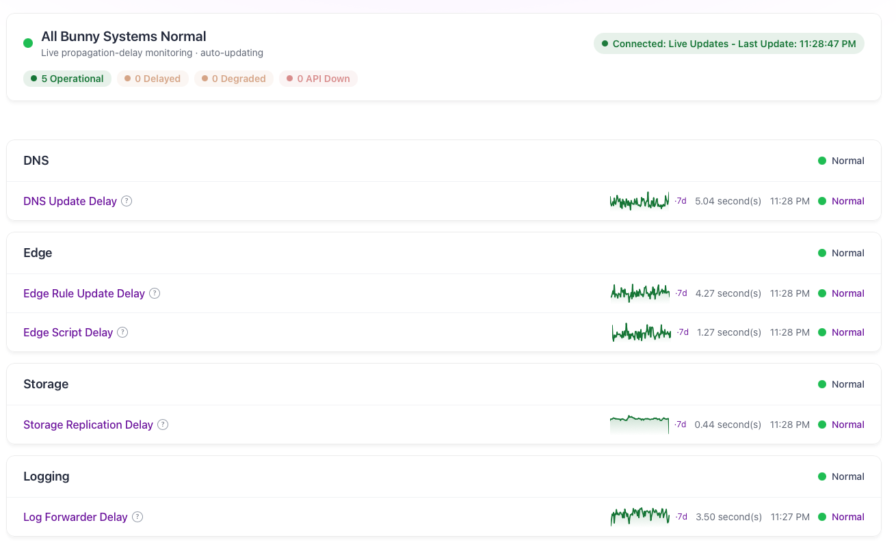
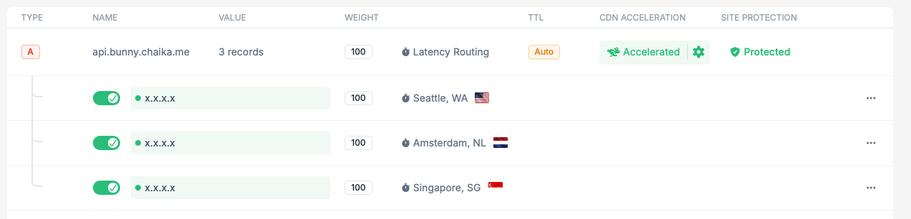
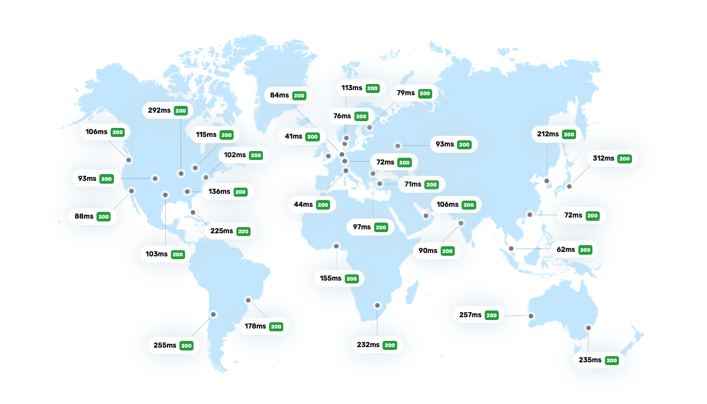

I like monitoring services and getting some understanding of how long it takes for an action performed to be reflected globally, and really just any sort of data at all of distributed systems. I’ve been monitoring Bunny for just shy of two years now, starting with DNS Update Delay [Nov 6, 2024], how long it takes to propagate an updated DNS Record, and later expanding into Edge Rule/Edge Script Update Delay, Purge Delay, and more.

I see these monitoring projects as a fun way to learn the platform. Another way is hosting the data viewing website on the said monitored platform. It’s a simple Astro SSR website originally hosted on Cloudflare Workers.

Bunny has all the pieces you need for Edge SSR with Edge Scripting based on Deno and Edge Storage, although without framework support yet. They’re working on [an Astro adapter](https://github.com/BunnyWay/bunny-adapters) but it’s currently not ready for production.

I build the Astro SSR site using the Deno adapter and using esbuild to bundle into a single js file, and then making one small surgical change to use Bunny.v1.serve (Bunny’s own http handler hook) rather than Deno.serve, lets me deploy the SSR part as an Edge Script. I use a Bunny Edge Rule, sending requests without a file extension to the SSR Edge Script, and the rest to a fast replicated SSD Storage zone holding the website assets. Some simple scripts handle this deployment mostly seamlessly.

The API/data comes from a self-hosted cluster of Virtual Servers by different providers, for independence from any monitored infrastructure. I use Bunny DNS’s built in latency routing on a CDN Accelerated zone to route requests to the lowest-latency healthy server, with Burrow Smart Routing accelerating the origin path. I also utilize Bunny’s support of WebSockets for real-time data updates.


flowchart TD
Visitor[Visitor] --> CDN[Bunny Pull Zone]
CDN -->|Static assets| Storage[Bunny Storage]
CDN -->|Page request: Edge Rule| Script[Astro SSR Edge Script]
Visitor -->|Browser API requests| API[api.bunny.chaika.me]
Script -->|SSR API requests| API
API --> DNS[Bunny DNS latency routing]
DNS -->|Select a healthy nearby origin| Accelerated[CDN Accelerated API zone and Burrow]
Accelerated --> Origins[Self-hosted API servers across providers]
Checks[Bunny DNS health checks] -.->|Monitor availability| Origins
Checks -.->|Feed origin status| DNS


In my tests, even ssr fetching uncached data was responsive across the sampled locations, thanks to Edge Scripting’s many supported locations alongside Burrow Smart Routing.

At low/moderate traffic, the Bunny usage charges are pennies a month for a full Edge SSR website and load balancing/DDoS protection for the API & data. I’ve been running this setup since May of 2025 without any issues or worries about ssr servers!

The website is hosted at https://delay.bunny.chaika.me!
